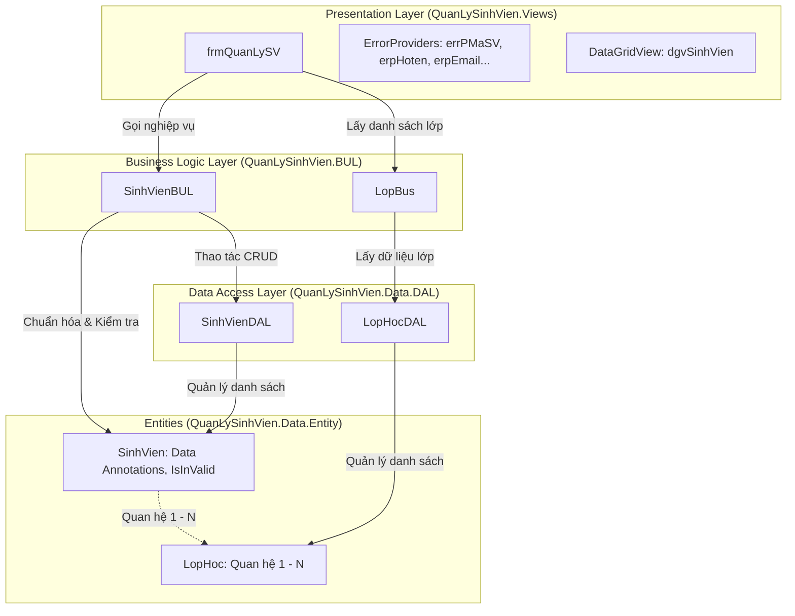

# BÀI THỰC HÀNH 4: KIẾN TRÚC PHÂN TẦNG (3-LAYER) & LẬP TRÌNH SỰ KIỆN

**Môn học:** Lập trình nâng cao (LTNC)  
**Sinh viên thực hiện:** Phạm Văn Quang  
**Mã số sinh viên (MSSV):** 23110342  
**Đơn vị:** Đại học Quốc gia Hà Nội - Trường Đại học Việt Nhật (VJU)  
**Kho lưu trữ (GitHub):** [https://github.com/QUANGPV021/23110342_PhamVanQuang_LTNC/tree/main/buoi4](https://github.com/QUANGPV021/23110342_PhamVanQuang_LTNC/tree/main/buoi4)

---

## 1. Yêu cầu đề bài (Bài 2: Tách Layer)

Dựa trên yêu cầu tài liệu `Bài thực hành 3 Lập trình sự kiện.docx` (Phần Bài 2: Tách Layer), bài tập yêu cầu tái cấu trúc và hoàn thiện ứng dụng Quản lý Sinh viên theo **Kiến trúc phân tầng (3-Layer Architecture)**:

1. **Tầng Data Access Layer (DAL):**
   - Ứng với mỗi thực thể, xây dựng một lớp tại tầng DAL có nhiệm vụ thực hiện các thao tác với nguồn dữ liệu (DataList trong bộ nhớ): Thêm, Sửa, Xóa, Lấy về toàn bộ, Lấy về theo ID/Mã lớp.
   - Các lớp: `SinhVienDAL`, `LopHocDAL` nằm trong namespace `QuanLySinhVien.Data.DAL`.
   - Các thực thể: `SinhVien`, `LopHoc` nằm trong namespace `QuanLySinhVien.Data.Entity`.
2. **Tầng Business Layer (BUL / BUS):**
   - Ứng với mỗi thực thể / Use case, xây dựng một lớp tầng Business thực hiện các quy tắc nghiệp vụ:
     - Kiểm tra tính hợp lệ dữ liệu sinh viên thông qua phương thức `sv.IsInValid()` (sử dụng Data Annotations).
     - Chuẩn hóa dữ liệu đầu vào: Cắt bỏ khoảng trắng đầu/cuối và chuẩn hóa các khoảng trắng liên tiếp bằng biểu thức chính quy `Regex(@"\s+")`.
     - Xử lý bắt và ném các ngoại lệ nghiệp vụ (`Exception`).
   - Các lớp: `SinhVienBUL`, `LopBus` nằm trong namespace `QuanLySinhVien.BUL`.
3. **Tầng Presentation Layer (Views / GUI):**
   - Chỉ giữ lại phần xử lý về giao diện người dùng và điều khiển sự kiện:
     - Form chính: `frmQuanLySV` nằm trong namespace `QuanLySinhVien.Views`.
     - Tải danh sách lớp hiển thị lên `cboLop`. Khi chọn lớp thì hiển thị danh sách sinh viên của lớp đó trên DataGridView (`cboLop_SelectedIndexChanged`).
     - Tương tác với `txtMaSV`:
       - `txtMaSV_Enter`: Chọn toàn bộ văn bản (`SelectAll()`).
       - `txtMaSV_KeyPress`: Nhấn phím Enter chuyển tiêu điểm sang `dtpNgaySinh`.
       - `txtMaSV_TextChanged`: Tự động xóa thông báo lỗi của `errPMaSV`.
       - `txtMaSV_Leave`: Tìm kiếm sinh viên. Nếu tồn tại, hiển thị thông tin lên các điều khiển và bật chức năng Sửa, Xóa (disable Thêm); nếu chưa tồn tại, xóa trắng các trường và bật chức năng Thêm (disable Sửa, Xóa).
     - Chức năng Thêm / Sửa: Kiểm tra tính hợp lệ bằng Data Annotations (`sv.IsInValid()`). Nếu có trường thông tin nào vi phạm, sử dụng các `ErrorProvider` (`errPMaSV`, `erpHoten`, `erpEmail`, `erpDienThoai`, `erpLopHoc`, `erpDiem`) để chỉ điểm lỗi trực quan trên từng ô nhập liệu.
     - Chức năng Xóa: Xác thực cảnh báo nguy hiểm trước khi thực hiện xóa dữ liệu.
     - Nút Làm mới (`butLamMoi`): Xóa trắng form, reset ErrorProvider, đưa con trỏ về `txtMaSV` và thiết lập trạng thái nút phù hợp.
     - Bộ lọc và tìm kiếm nâng cao: Tìm kiếm theo từ khóa, lọc theo lớp học, và lọc theo điểm sàn.
     - Khi đóng form: Hỏi xác nhận thoát ứng dụng.

---

## 2. Cấu trúc thư mục `buoi4`

```text
buoi4/
├── Bài thực hành 3 Lập trình sự kiện.docx   # File Word đề bài gốc từ giảng viên
├── .gitignore                               # Loại trừ bin/, obj/, .vs/
├── code.slnx                                # File Solution XML thế hệ mới
├── QuanLySinhVien.sln                       # Solution tiêu chuẩn Visual Studio
├── README.md                                # Báo cáo chi tiết và tài liệu hướng dẫn
│
├── QuanLySinhVien/                          # Dự án Windows Forms (Presentation + Core Layers)
│   ├── QuanLySinhVien.csproj
│   ├── Program.cs                           # Điểm khởi chạy ứng dụng (Application.Run(new frmQuanLySV()))
│   ├── Data/
│   │   ├── Entity/
│   │   │   ├── SinhVien.cs                  # Thực thể SinhVien (Data Annotations, IsInValid(), IsValid())
│   │   │   └── LopHoc.cs                    # Thực thể LopHoc (Quan hệ 1 - N với SinhVien)
│   │   └── DAL/
│   │       ├── SinhVienDAL.cs               # Data Access: CRUD & DataList sinh viên
│   │       └── LopHocDAL.cs                 # Data Access: Quản lý danh sách lớp học
│   ├── BUL/
│   │   ├── SinhVienBUL.cs                   # Business Logic: Validation, Chuẩn hóa Regex, Bắt ngoại lệ
│   │   └── LopBus.cs                        # Business Logic: Điều phối nghiệp vụ lớp học
│   └── Views/
│       ├── frmQuanLySV.cs                   # Code-behind xử lý toàn bộ sự kiện & ErrorProviders
│       └── frmQuanLySV.Designer.cs          # Thiết kế giao diện WinForms hiện đại, chuẩn ảnh mẫu
│
└── QuanLySinhVien.ConsoleApp/               # Dự án Console kiểm thử tự động toàn diện
    ├── QuanLySinhVien.ConsoleApp.csproj
    └── Program.cs                           # Kịch bản kiểm thử tự động cho DAL, BUL, Regex, Validation
```

---

## 3. Kiến trúc hệ thống chi tiết



### 3.1. Các quy tắc kiểm tra tính hợp lệ (Data Annotations)
- **Mã sinh viên (`MaSV`)**:
  - `[Required(ErrorMessage = "Mã sinh viên không được để trống.")]`
  - `[RegularExpression(@"^SV\d{3,}$", ErrorMessage = "Mã sinh viên phải có định dạng bắt đầu bằng 'SV' và theo sau bởi ít nhất 3 chữ số (ví dụ: SV000123).")]`
- **Họ và tên (`HoTen`)**:
  - `[Required(ErrorMessage = "Họ và tên không được để trống.")]`
  - `[StringLength(50, MinimumLength = 2, ErrorMessage = "Họ và tên phải có từ 2 đến 50 ký tự.")]`
- **Email (`Email`)**:
  - `[Required(ErrorMessage = "Email không được để trống.")]`
  - `[EmailAddress(ErrorMessage = "Email không đúng định dạng hợp lệ (ví dụ: an.nv@vju.ac.vn).")]`
- **Số điện thoại (`SoDienThoai`)**:
  - `[Required(ErrorMessage = "Số điện thoại không được để trống.")]`
  - `[RegularExpression(@"^0\d{9}$", ErrorMessage = "Số điện thoại phải gồm đúng 10 chữ số và bắt đầu bằng số 0.")]`
- **Điểm (`Diem`)**:
  - `[Required(ErrorMessage = "Điểm không được để trống.")]`
  - `[Range(0.0, 10.0, ErrorMessage = "Điểm phải nằm trong khoảng từ 0.0 đến 10.0.")]`
- **Lớp học (`MaLop`)**:
  - `[Required(ErrorMessage = "Vui lòng chọn lớp học.")]`
- **Trạng thái (`TrangThai`)**:
  - `[Required(ErrorMessage = "Vui lòng chọn trạng thái.")]`

### 3.2. Phương thức kiểm tra `IsInValid()` trên Entity
```csharp
public List<ValidationResult> IsInValid()
{
    var context = new ValidationContext(this, serviceProvider: null, items: null);
    var results = new List<ValidationResult>();
    Validator.TryValidateObject(this, context, results, validateAllProperties: true);
    return results;
}
```

### 3.3. Chuẩn hóa dữ liệu bằng Regex tại tầng Business (BUL)
```csharp
// Cắt khoảng trắng dư thừa và thay thế chuỗi khoảng trắng liên tiếp bằng 1 dấu cách duy nhất
sv.HoTen = Regex.Replace(sv.HoTen.Trim(), @"\s+", " ");
sv.MaSV = sv.MaSV.Trim();
sv.Email = sv.Email.Trim();
sv.SoDienThoai = sv.SoDienThoai.Trim();
```

### 3.4. Báo lỗi trực quan qua ErrorProvider tại tầng Giao diện (Views)
```csharp
foreach (var error in errors)
{
    string fieldName = error.MemberNames.First();
    switch (fieldName)
    {
        case "MaSV":
            errPMaSV.SetError(txtMaSV, error.ErrorMessage);
            break;
        case "HoTen":
            erpHoten.SetError(txtHoTen, error.ErrorMessage);
            txtHoTen.Focus();
            break;
        case "Email":
            erpEmail.SetError(txtEmail, error.ErrorMessage);
            txtEmail.Focus();
            break;
        case "SoDienThoai":
        case "DienThoai":
            erpDienThoai.SetError(txtDienThoai, error.ErrorMessage);
            txtDienThoai.Focus();
            break;
        case "MaLop":
            erpLopHoc.SetError(cboLop, error.ErrorMessage);
            break;
        case "Diem":
            erpDiem.SetError(numDiem, error.ErrorMessage);
            break;
    }
}
```

---

## 4. Danh sách sự kiện được xử lý trên Form

| Sự kiện | Điều khiển | Mục đích & Nghiệp vụ |
| :--- | :--- | :--- |
| `Load` | `frmQuanLySV` | Khởi tạo dữ liệu lớp học, trạng thái, DataGridView, đặt trạng thái ban đầu (`TogAdd(true)`). |
| `Shown` | `frmQuanLySV` | Thiết lập con trỏ mặc định tại `txtMaSV`. |
| `Enter` | `txtMaSV` | Chọn toàn bộ nội dung trong ô (`SelectAll()`) giúp thao tác nhanh. |
| `KeyPress` | `txtMaSV` | Khi nhấn phím Enter, tự động chuyển tiêu điểm sang chọn ngày sinh (`dtpNgaySinh`). |
| `TextChanged` | `txtMaSV` | Tự động xóa cảnh báo lỗi của `errPMaSV` khi người dùng nhập ký tự mới. |
| `Leave` | `txtMaSV` | Tra cứu sinh viên theo mã. Nếu tìm thấy: hiển thị toàn bộ thông tin lên form, bật Sửa/Xóa và tắt Thêm; nếu không thấy: xóa trắng các ô và bật Thêm, tắt Sửa/Xóa. |
| `Click` | `butThem` | Xác thực dữ liệu qua `sv.IsInValid()`. Báo lỗi qua `ErrorProvider` nếu sai; gọi `svb.AddSinhVien(sv)` nếu đúng và tải lại lưới. |
| `Click` | `butSua` | Kiểm tra tính hợp lệ dữ liệu. Gọi `svb.UpdateSinhVien(sv)`, cập nhật dữ liệu và hiển thị thông báo. |
| `Click` | `butXoa` | Cảnh báo hành động nguy hiểm qua hộp thoại xác thực `MessageBox (Yes/No)`. Thực hiện xóa khi người dùng chọn Yes. |
| `Click` | `butLamMoi` | Xóa trắng form, xóa các lỗi ErrorProvider, đưa con trỏ về `txtMaSV`, đặt lại trạng thái nút. |
| `SelectedIndexChanged` | `cboLop` | Lấy danh sách sinh viên theo lớp được chọn qua `svb.GetSinhVienByMaLop()` và gán vào DataGridView. |
| `Click` | `butTimKiem` | Tìm kiếm kết hợp theo từ khóa, lớp học và ngưỡng điểm sàn. |
| `Click` | `butHienThiTatCa` | Reset các bộ lọc và hiển thị toàn bộ sinh viên trong cơ sở dữ liệu. |
| `CellClick` | `dgvSinhVien` | Khi nhấp vào một dòng trên lưới, nạp thông tin sinh viên lên form để xem/sửa/xóa. |
| `FormClosing` | `frmQuanLySV` | Hiển thị hộp thoại xác nhận người dùng có chắc chắn muốn thoát ứng dụng hay không. |

---

## 5. Hướng dẫn chạy và kiểm thử

### Cách 1: Chạy bằng Visual Studio (Khuyên dùng)
1. Mở file `QuanLySinhVien.sln` hoặc `code.slnx` bằng Visual Studio 2022 (v17.10 trở lên).
2. Đặt `QuanLySinhVien` làm **Startup Project**.
3. Nhấn **F5** hoặc nút **Start** để khởi chạy ứng dụng Windows Forms.

### Cách 2: Chạy kiểm thử tự động với ConsoleApp
1. Đặt `QuanLySinhVien.ConsoleApp` làm **Startup Project** (hoặc chạy lệnh `dotnet run --project QuanLySinhVien.ConsoleApp`).
2. Chương trình sẽ tự động thực thi chuỗi kịch bản kiểm thử:
   - DAL CRUD & Quản lý danh sách đối tượng
   - Xác thực Data Annotations (`IsInValid()`)
   - Tầng Business BUL: Chuẩn hóa Regex khoảng trắng thừa, bắt lỗi trùng lặp
   - Tìm kiếm & Lọc dữ liệu đa tiêu chí
   - Mô phỏng toàn bộ logic sự kiện trên giao diện và ErrorProvider mapping.
